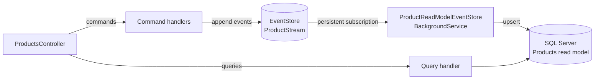

# Event Sourcing Pattern

A product catalogue where every change is stored as an event in **EventStore**, and a background projection builds a **SQL Server read model** from those events. Commands and queries are separated with **MediatR** (CQRS).

> **Study project (2022).** Built while learning event sourcing and CQRS. See [How I would build it today](#how-i-would-build-it-today).

## How it works

- **Write side:** `CreateProduct`, `ChangeProductName`, `ChangeProductPrice` and `DeleteProduct` commands append `ProductCreated`, `ProductNameChanged`, `ProductPriceChanged` and `ProductDeleted` events to `ProductStream` ([`EventStores/ProductStream.cs`](EventSourcing.API/EventStores/ProductStream.cs)).
- **Read side:** [`BackgroundServices/ProductReadModelEventStore.cs`](EventSourcing.API/BackgroundServices/ProductReadModelEventStore.cs) consumes the stream through a persistent subscription, applies each event to the `Products` table, and acknowledges it manually.
- **Queries** (`GetAllListByUserId`) read only from the SQL Server read model.

## Tech

.NET 5 · ASP.NET Core · EventStore 5 (TCP client) · MediatR · EF Core 5 · SQL Server

## Running locally

1. Start EventStore: the included [`Dockerfile`](Dockerfile) builds `eventstore/eventstore:release-5.0.8` with a self-signed certificate.
2. In the EventStore UI, create a persistent subscription named `agroup` on the stream `ProductStream`. The code connects to it but does not create it.
3. Set the `MsSql` and `EventStore` connection strings through user secrets or environment variables, then apply migrations: `dotnet ef database update --project EventSourcing.API`.
4. Run `EventSourcing.API` and use the Swagger UI.

The project targets .NET 5, which is out of support. It builds with a current SDK; to run it you need the .NET 5 runtime or `DOTNET_ROLL_FORWARD=Major`.

## How I would build it today

- **One stream per aggregate.** Streams like `product-{id}`, appended with an expected version, give each product its own history and optimistic concurrency.
- **Rehydrate the aggregate before handling a command**, so business rules (for example, no price change after deletion) are checked against the current state.
- **Checkpointed, idempotent projection.** Record the last processed position with the read model, so it can be replayed or rebuilt safely.
- **Subscription created at startup** instead of in the EventStore UI.
- **EventStoreDB gRPC client**, the successor to the TCP client used here.
